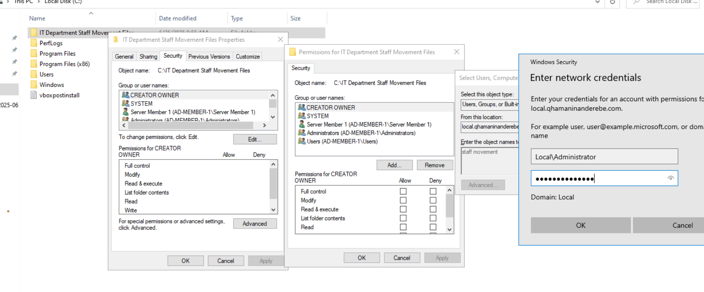
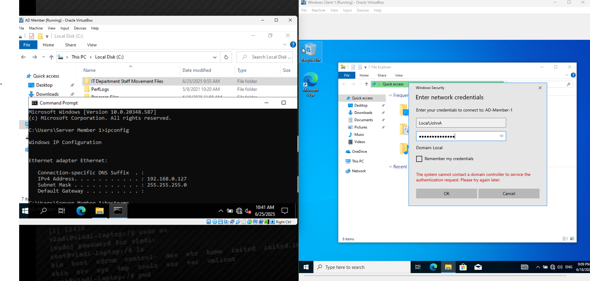
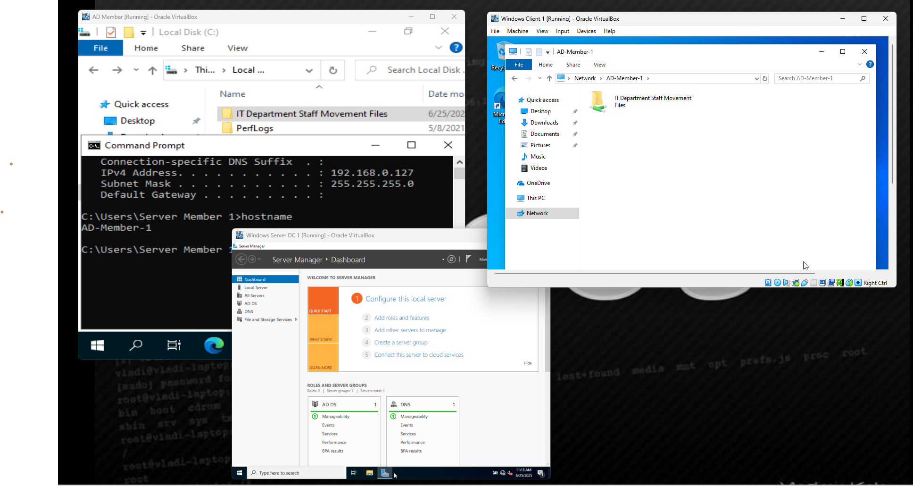

# file-share-access-via-security-group
Lab to demonstrate how user access to a network file share can be managed via Active Directory security groups and NTFS permissions on a Windows File Server.

# 🗂️ File Share Access via Security Group

This lab demonstrates how to manage access to a shared folder on a Windows File Server by using Active Directory (AD) **security groups**. Users assigned to the security group are granted permissions to access the shared folder hosted on another machine.

---

## 🎯 Objective

- Showcase how client systems can securely access shared files using **AD-based group permissions**.
- Highlight the role of **NTFS and Share permissions** in controlling access.
- Emphasize the value of **centralized group-based access control**.

---

## 🛠️ Lab Setup

- **File Server:** Windows VM acting as the host of the shared folder.
- **Client Machine:** Windows VM joined to the same domain.
- **Active Directory:** Used to manage users and security groups.
- **Security Group:** Created in AD and assigned the proper share/NTFS permissions.

---

## 📸 Screenshots Walkthrough

| Step | Description | Screenshot |
|------|-------------|------------|
| 1️⃣ | **Windows client added to Security Group** with access rights to the shared folder. |  |
| 2️⃣ | **Credential prompt appears** for authentication. User enters credentials for a domain account with access. |  |
| 3️⃣ |  **User accessing the shared folder** using the IP address and share name (`\\<FileServerIP>\<FolderName>`). |  |

---

## 🧠 Key Concepts Demonstrated

- Group-based access control
- SMB (Server Message Block) file sharing
- NTFS and Share permission layering
- User authentication via Active Directory

---

## 📘 How It Works

1. **Create a Security Group** in Active Directory.
2. **Add the client machine’s user** to that group.
3. On the **File Server**, configure:
   - Folder share permissions (allow the group).
   - NTFS permissions (grant appropriate access to the group).
4. From the **client**, navigate to:
